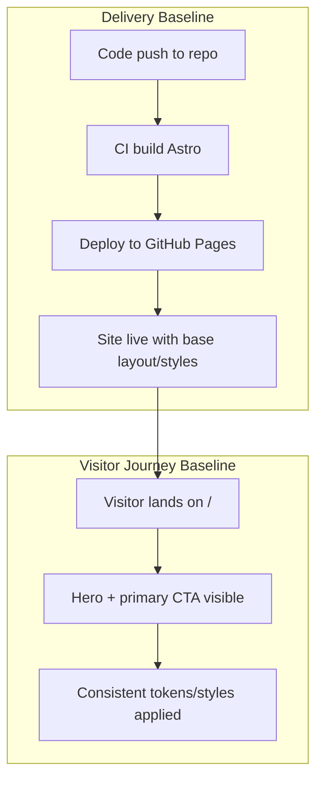

# Feature: F-000 Foundations - Technical Design

**Purpose**: Establish the operational baseline for the site: Astro app scaffolding, CI/CD to GitHub Pages, design tokens, base layout, global styles, and integration hooks that other features build on.

## 1. Feature Overview

**Business Purpose**: Provide a reliable, professional baseline so features can be delivered quickly and consistently, with trust-building visuals and zero-friction deployments.

**User Problem**: Without a solid foundation, visitors see inconsistent visuals and broken flows; the team ships slowly and inconsistently.

**Business Impact**: Faster iteration velocity and consistent brand trust; enables all booking and engagement features to work predictably.

**Success Metrics**:

- CI/CD deploys on every push to the default branch with zero manual steps
- Core Web Vitals pass on home page (good LCP/CLS/INP per Lighthouse defaults)

## 2. System / User Flow

## 3. Change Summary Table

| Module/File Path               | Item Name           | Status | Description                                                                               |
| :----------------------------- | :------------------ | :----- | :---------------------------------------------------------------------------------------- |
| `package.json`                 | NPM Scripts         | New    | Add `dev`, `build`, `preview`, and `lint` scripts to standardize local dev and CI builds. |
| `astro.config.mjs`             | Astro Config        | New    | Configure site URL, integrations, and base path for GitHub Pages compatibility.           |
| `.github/workflows/deploy.yml` | GitHub Pages Deploy | New    | CI workflow to build Astro and deploy to GitHub Pages on push to default branch.          |
| `src/styles/tokens.css`        | Design Tokens       | New    | CSS custom properties for color, spacing, typography, z-index, and radii.                 |
| `src/styles/global.css`        | Global Styles       | New    | Normalize, base element styles, typography scale, and utility classes consuming tokens.   |
| `src/components/Seo.astro`     | SEO Component       | New    | Reusable meta defaults: title, description, canonical, OpenGraph, Twitter.                |
| `src/layouts/BaseLayout.astro` | Base Layout         | New    | Shared HTML shell applying tokens, global styles, and `Seo`.                              |
| `src/pages/index.astro`        | Home Page Scaffold  | New    | Minimal hero/header scaffold with primary CTA anchor target (`#book`), no Calendly yet.   |
| `public/robots.txt`            | Robots              | New    | Allow all crawling; reference sitemap when added in later features.                       |
| `.gitignore`                   | Ignore Rules        | New    | Ensure `node_modules`, build output, local env files are ignored.                         |

## 4. Implementation Details

### 4.1. Tooling Module (`package.json`)

**Module Purpose**: Provide consistent local dev and CI entry points.
**Module Dependencies**: Astro CLI.
**Business Context**: Faster, repeatable development and deployments.
**Integration Points**: Consumed by CI workflow.

#### Components/Functions in this Module:

##### NPM Scripts: `dev|build|preview|lint` → `void`

- **What**: Standard scripts to run Astro dev server, build static output, preview build, and lint.
- **Why**: Establishes a predictable developer workflow and enables CI.
- **Constraints**: Must not require interactive input in CI.
- **Integration Points**: Called by GitHub Actions `deploy.yml`.

---

### 4.2. Astro Config Module (`astro.config.mjs`)

**Module Purpose**: Central configuration for Astro build and routing.
**Module Dependencies**: Astro core; optional integrations (none required at this stage).
**Business Context**: Ensures compatibility with GitHub Pages and consistent URLs.
**Integration Points**: Used during build in CI and local dev.

#### Settings

- **What**: Set `site` URL, and if needed `base` for Pages; enable strict routing and trailing slash policy.
- **Why**: Proper canonical links and asset paths to avoid broken resources post-deploy.
- **Constraints**: `site` must match GitHub Pages URL format.
- **Integration Points**: `Seo.astro` reads canonical from `Astro.site`.

---

### 4.3. CI/CD Workflow (`.github/workflows/deploy.yml`)

**Module Purpose**: Automate build and deploy to GitHub Pages on push.
**Module Dependencies**: Node setup, actions for Pages deploy.
**Business Context**: Zero-friction deployments increase velocity and confidence.
**Integration Points**: Uses project scripts; publishes `dist/`.

##### Job: `build-and-deploy` → `success|failure`

- **What**: Checkout, setup Node LTS, install deps with cache, run `build`, upload artifact, deploy to Pages.
- **Why**: Guarantees consistent, reproducible releases.
- **Constraints**: Fully non-interactive; use exact permissions for Pages.
- **Integration Points**: Relies on `package-lock.json` for immutable installs.

---

### 4.4. Design Tokens (`src/styles/tokens.css`)

**Module Purpose**: Single source of truth for brand theming.
**Module Dependencies**: None.
**Business Context**: Consistent, professional visuals build trust.
**Integration Points**: Consumed by `global.css` and layout/components.

##### Tokens: CSS Custom Properties → `:root`

- **What**: Define `--color-*`, `--space-*`, `--font-size-*`, `--radius-*`, `--z-*`.
- **Why**: Enables theme consistency and easy future updates.
- **Constraints**: No color values tied to content; semantic naming (`--color-text`, `--color-bg`).
- **Integration Points**: Referenced in utilities and components.

---

### 4.5. Global Styles (`src/styles/global.css`)

**Module Purpose**: Normalize and baseline typography/layout.
**Module Dependencies**: `tokens.css`.
**Business Context**: Clean, readable baseline UX.
**Integration Points**: Imported by `BaseLayout.astro`.

##### Base CSS: Utilities + Resets → `CSS`

- **What**: Modern normalize, body defaults, heading scale, link styles, container utilities.
- **Why**: Avoids browser inconsistencies; accelerates feature development.
- **Constraints**: Keep minimal; avoid component-specific rules.
- **Integration Points**: Global across all pages.

---

### 4.6. SEO Component (`src/components/Seo.astro`)

**Module Purpose**: Centralize default meta tags.
**Module Dependencies**: Astro props; `Astro.site` config.
**Business Context**: Baseline SEO and sharability.
**Integration Points**: Included in `BaseLayout.astro`.

##### Component Props: `{ title?: string, description?: string, canonical?: string }` → `head`

- **What**: Render `<title>`, meta description, canonical, OG/Twitter tags with sensible defaults.
- **Why**: Ensures every page has good metadata without duplication.
- **Constraints**: Must avoid duplicate tags; client-side JS not required.
- **Integration Points**: Reads defaults from site config; overridden per page when needed.

---

### 4.7. Base Layout (`src/layouts/BaseLayout.astro`)

**Module Purpose**: Shared HTML shell and global concerns.
**Module Dependencies**: `Seo.astro`, `global.css`, `tokens.css`.
**Business Context**: Consistency and maintainability across pages.
**Integration Points**: All pages import this layout.

##### Slot Layout: `{ children, seo?: SeoProps }` → `html`

- **What**: Wrap page content with `<html>`/`<body>`, include styles and SEO.
- **Why**: Eliminates duplication and ensures consistency.
- **Constraints**: No page-specific logic; purely structural.
- **Integration Points**: Used by `src/pages/index.astro`.

---

### 4.8. Home Page Scaffold (`src/pages/index.astro`)

**Module Purpose**: Minimal landing page to validate layout/styles.
**Module Dependencies**: `BaseLayout.astro`.
**Business Context**: First impression and baseline for subsequent features.
**Integration Points**: Placeholder anchor for future CTA modal and embedded Calendly.

##### Page Sections: `header|main|footer` → `html`

- **What**: Render brand, headline, brief value proposition, and a primary CTA button linking to `#book` anchor; no Calendly yet.
- **Why**: Establishes the skeleton to plug F-001/F-004 later.
- **Constraints**: Keep content minimal; avoid feature-specific code.
- **Integration Points**: CTA target used by future features.

---

### 4.9. Robots (`public/robots.txt`)

**Module Purpose**: Baseline crawler directives.
**Module Dependencies**: None.
**Business Context**: Ensure site is indexable from day one.
**Integration Points**: Will reference sitemap when F-009 adds generation.

##### File Content: `text/plain`

- **What**: `User-agent: *` + `Allow: /` with comment noting future sitemap.
- **Why**: Basic SEO hygiene.
- **Constraints**: No environment-specific differences at this stage.
- **Integration Points**: Future F-009 updates add `Sitemap:` line.

---

### 4.10. Ignore Rules (`.gitignore`)

**Module Purpose**: Keep repository clean and builds reproducible.
**Module Dependencies**: None.
**Business Context**: Prevent accidental commits of artifacts and secrets.
**Integration Points**: Affects developer workflows and CI.

##### Patterns: `node_modules/`, `.astro/`, `dist/`, `.env*`

- **What**: Ignore standard Node/Astro outputs and local env files.
- **Why**: Reduces noise and risk.
- **Constraints**: Keep minimal; do not ignore source files.
- **Integration Points**: CI caches dependencies separately.

## 5. Test Scenarios

TODO: Populate in T11b (happy paths, regressions, accessibility, performance)
