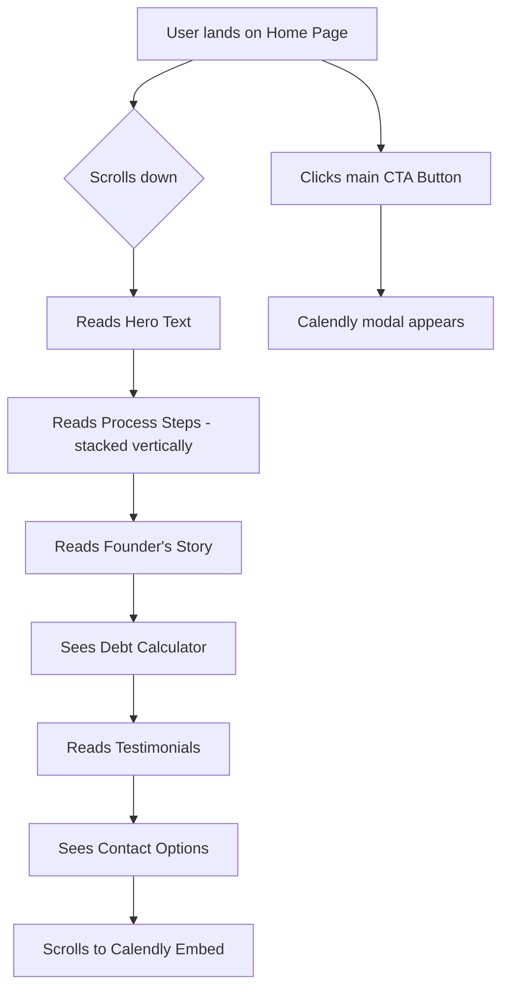
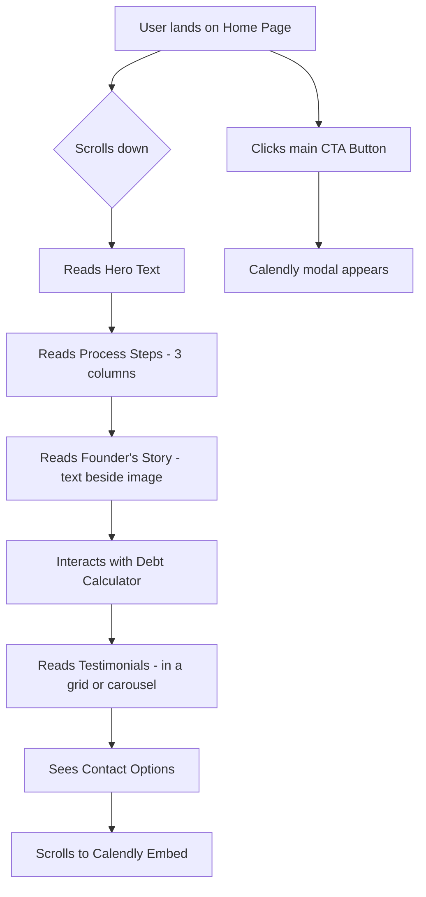

# UI Page Design: Home Page

This document outlines the design for the Home Page of the JMJ Financial Coaching website, following the structure from `T08 - UI Page Design.md`.

## 1. Page Overview & Goals

*   **Page Name**: Home Page
*   **URL Slug**: `/`
*   **Primary Purpose**: To serve as the main entry point for the website, introducing visitors to JMJ Financial Coaching, building trust, and clearly presenting the value proposition.
*   **Business Objective**: To convert visitors into qualified leads by encouraging them to book a free, no-obligation consultation.
*   **Main User Goals**:
    *   Quickly understand what JMJ Financial Coaching does and who it is for.
    *   Learn about the process and benefits of financial coaching.
    *   Evaluate if the service is a good fit for their personal financial situation.
    *   Easily find and take the next step to get started (book a consultation).

## 2. Content & Structure

The page is designed as a single, scrolling narrative that guides the user from awareness to action.

### Content Hierarchy

1.  **Navigation Header**: Sticky header for easy navigation.
2.  **Hero Section**: Immediately grabs attention with a compelling value proposition.
3.  **Process Section**: Clearly explains the "how" in three simple steps.
4.  **Value Proposition ("How I Can Help")**: Reinforces the core benefits of the service.
5.  **Founder's Story**: Builds a personal connection and establishes trust.
6.  **Debt Calculator Section**: Engages users with an interactive tool to understand their debt.
7.  **Testimonials**: Provides social proof and builds credibility.
8.  **Contact Section**: Provides multiple clear options for getting in touch.
9.  **Calendly Embed (Final CTA)**: A clear, final prompt to book a consultation, embedded directly on the page.
10. **Footer**: Contains contact information and site links.
11. **Floating Messenger Widget**: Provides an alternative, low-friction contact method.

### Detailed Content

*   **Navigation**:
    *   Logo: JMJ Financial Coaching Logo
    *   Links: Home, About, Services, Testimonials, Contact
    *   CTA Button: "Book a Free Consultation"

*   **Hero Section**:
    *   **Background**: A professional and welcoming image of Jennifer, the founder.
    *   **Title**: `JMJ Financial Coaching LLC`
    *   **Tagline**: `Helping you achieve financial peace one step at a time.`
    *   **Primary CTA**: Button: "Book a Free Consultation" (triggers pop-up modal)

*   **Process Section**:
    *   **Title**: `Our Simple 3-Step Process`
    *   **Step 1**: **Book a Consultation** - "This is a hassle-free, no-obligation call to get to know each other a bit..."
    *   **Step 2**: **Create a Plan Together** - "Once we outline your areas of biggest need, we'll work together to create a plan..."
    *   **Step 3**: **Work the Plan Together** - "True change comes when behavior is adjusted... I'm here to coach you along the way..."

*   **Value Proposition ("How I Can Help")**:
    *   **Title**: `Guidance and Accountability on Your Financial Journey`
    *   **Text**: "I can help you change your behavior with money and provide accountability along the way..."

*   **Founder's Story**:
    *   **Title**: `My Story`
    *   **Image**: Professional photo of Jennifer.
    *   **Text**: (Abridged) "My husband and I have been married for 12 years... Becoming a financial coach has been a true blessing in my life."

*   **Debt Calculator Section**:
    *   **Title**: `Visualize Your Path to Zero Debt`
    *   **Text**: "How long will it take to pay off your debt with only minimum payments? Use our advanced debt payoff calculator to see the timeline. The answer might surprise you. Discover how a personalized coaching plan can help you get there faster and keep you focused on your goal."
    *   **CTA**: Button: "Launch the Calculator"
    *   **Link**: `mydebtfree.coach/jmj`

*   **Testimonials**:
    *   **Title**: `What My Clients Say`
    *   **Content**: Display 2-3 testimonials in cards.

*   **Contact Section**:
    *   **Title**: `Have Questions? Contact Me.`
    *   **Options**: Three clear calls-to-action:
        *   **Call Me**: A button that initiates a phone call (`tel:309-279-5518`).
        *   **Chat with Me**: A button that opens Facebook Messenger (`m.me/105961640819095`).
        *   **Book a Consult**: A button that smoothly scrolls the user down to the embedded Calendly widget.

*   **Calendly Embed (Final CTA)**:
    *   **Title**: `Ready to Take Control? Book Your Free Consultation.`
    *   **Content**: A directly embedded Calendly widget for seamless scheduling, removing all friction from the booking process.

*   **Footer**:
    *   **Contact Info**: JMJ Financial Coaching LLC, Bloomington, IL 61704, Phone: 309-279-5518, Email: jennifer@jmjfinancialcoaching.com
    *   **Copyright**: © 2025 JMJ Financial Coaching LLC. All Rights Reserved.

## 3. Interactions & Responsive Behavior

### Key User Interactions

*   **Book a Free Consultation Button (Header/Hero)**:
    *   **Action**: On click, a modal window (Calendly integration) opens, allowing the user to schedule a meeting without leaving the site.
*   **Launch the Calculator Button**:
    *   **Action**: Opens the `mydebtfree.coach/jmj` URL in a new tab.
*   **Contact Section Buttons**:
    *   **Call**: Initiates device's default phone application.
    *   **Chat**: Opens Facebook Messenger.
    *   **Book**: Scrolls to the Calendly embed section.
*   **Floating Messenger Widget**:
    *   **Action**: Opens a chat window to connect via Facebook Messenger.

### Responsive Design

The layout is fluid and adapts to different screen sizes, prioritizing a mobile-first approach.

#### Mobile User Journey

#### Desktop User Journey

